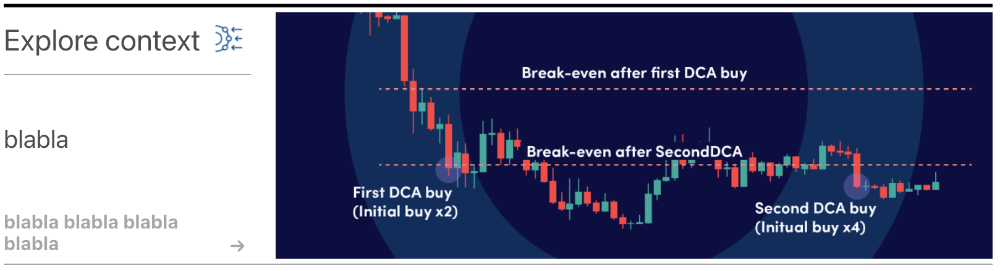
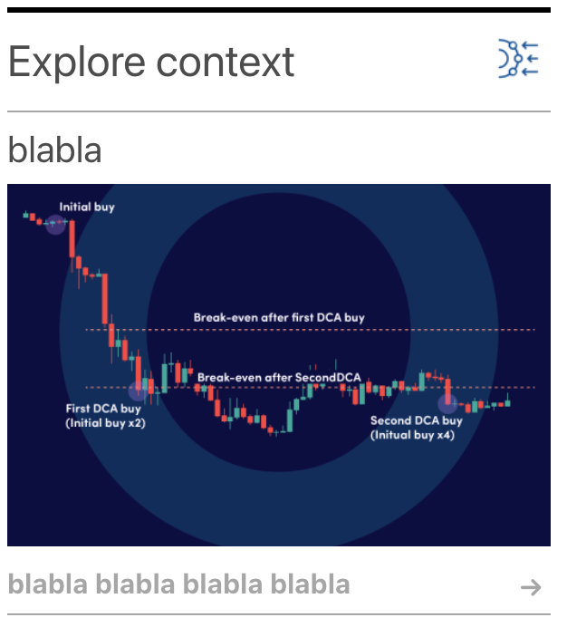

# Serendipity

/src/index.js - init react app

/src/App.js - handels loading data

/src/Banner.js - banner component

public/test.html contains example of the banner in use

```
  <div id="serendipity-banner"></div> 
  <script src="./static/js/bundle.js" id="1" layout="vertical" lang="EN-us"></script>
```

App can accept 3 parameters: id, layout (vertical/horizontal) and language.

If layout is not provided default "vertical" option will apply.

If language is not provided user browser settings will apply.





